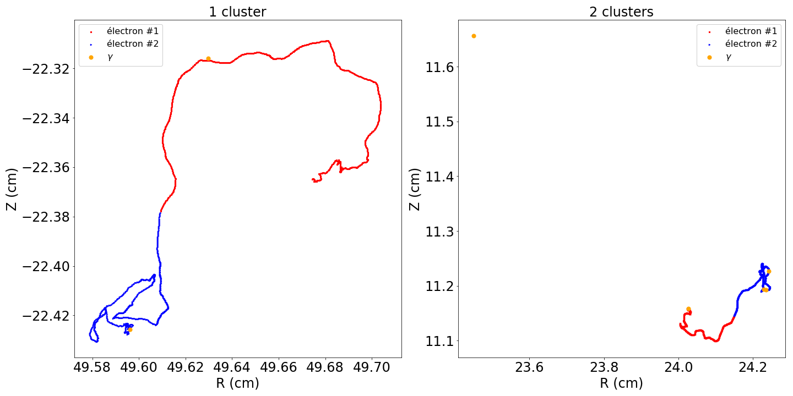

# Description 

This repository represents only a small fraction of the comprehensive research I have conducted for my thesis in particle physics. Here, I will provide you with some information about the code I wrote and its purpose. It involves some physics knowledge on neutrinos and their interactions with matter. 

While this repository serves as a concise and quick introduction to the topic, I invite you to explore my thesis for a more in-depth understanding.

## Introduction 

The purpose of the code provided in this repository is to analyze simulations of a specific radioactive decay known as neutrinoless double beta decay (0vbb). The aim is to gain insights into the potential signals that could be observed in a particular detector utilizing liquid xenon as the detection medium.

These simulations are carried out using a specialized physics software called GEANT4.

## Event simulations 

A 0vbb decay is characterized by the emission of two electrons with a total energy of 2.458 MeV. The distribution of energy and the direction between the two electrons depend on the considered decay models. In the light Majorana neutrino exchange model, which can be represented as the exchange of a left-handed neutrino with a right-handed antineutrino (known as the mass mechanism), the most probable case is that both electrons are emitted at 180 degrees from each other with an energy of Qββ/2 = 1.229 MeV each. This case will be considered for our simulations using the GEANT4 software, which allows simulating known physical processes using Monte Carlo methods. 

Thus, the expected signal in a 0vbb decay is simulated as two electrons, each with an energy of 1.229 MeV, emitted at 180 degrees from each other, uniformly and randomly distributed within a volume of 1 tonne of liquid xenon.

These electrons will travel a certain distance in the liquid xenon, depositing energy along their path. This allows for the reconstruction of the electron's path in the liquid xenon, which we will refer to as a trace.

In addition to the energy deposition, electrons moving through the liquid xenon emit bremsstrahlung radiation. Bremsstrahlung radiation is produced when an electron, traveling through a medium, is slowed down and deflected by the electric field of the medium's nuclei. Approximately 95% of the photons have an energy below 500 keV. A 500 keV photon has an average path length in the liquid xenon of about 1 cm. Therefore, these bremsstrahlung photons will redistribute a portion of the energy from the electrons emitted by the 0vbb decay. Depending on the interaction position of the bremsstrahlung photons with respect to the trace of the electrons emitted by the 0vbb decay, the events of this decay will be reconstructed as follows:
    - A single event: all the photons emitted by bremsstrahlung radiation are close enough to the main trace to produce only one signal.
    - Multiple events: one or more photons emitted by bremsstrahlung radiation have traveled a sufficiently long distance for the signal they produce to not be included in the main trace.

However, considering the higher background noise in the case of multiple events and the better energy resolution for single events, the search for 0vbb decay will be conducted by analyzing the data obtained from single events. Therefore, it is important to determine the proportion of events emitted by a 0vbb decay that will be reconstructed as single events.

## Clustering

To determine how many 0vbb decay will be seen as single event and then determine the detector efficiency and capability to detect this decay, a clustering in two steps was developped : 

  - pre-clustering : use of DBScan algorithm allowing separe single and multiple events in case of a perfect liquid xenon detector,
  - macro-clustering : use of liquid xenon detector properties and DBScan algorithm to separe "real" single and multiple events, include the fact that a detector is never perfect and includes bias on the reconstruction of events. 
  
Because those clustering implies complicated knowledge of physics (electron-matter interaction, liquid xenon detector), I will not detail here all the choice make. If you want to know more, you can read chapter 6.5.2 of my thesis, which you can read [here](https://theses.hal.science/tel-02926324) (in french).

